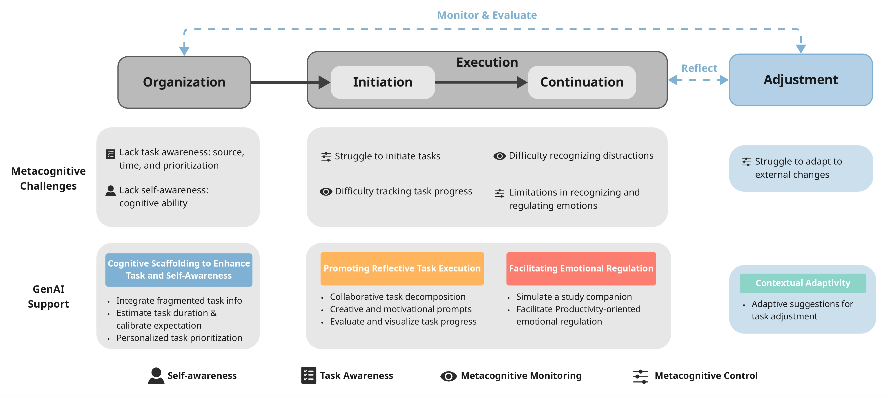

\* indicates Equal Contribution

### **Scaffolding Metacognition with GenAI: Exploring Design Opportunities to Support Task Management for University Students With ADHD** 
*ACM Conference on Human Factors in Computing Systems (CHI), 2026*

**Authors:** **Zihao ZHU**, Junnan YU, Yuhan LUO

**Abstract:** For university students transitioning to an independent and flexible lifestyle, having ADHD poses multiple challenges to their academic task management, which are closely tied to their metacognitive struggles—difficulties in awareness and regulation of one's own thinking processes. The recently surged Generative AI shows promise to mitigate these gaps with its advanced information understanding and generation capabilities. As an exploratory step, we conducted co-design sessions with 20 university students diagnosed with ADHD, followed by interviews with five experts specialized in ADHD intervention. Adopting a metacognitive lens, we examined participants' ideas on GenAI-based task management support and experts' assessments, which led to three design directions: providing cognitive scaffolding to enhance task and self-awareness, promoting reflective task execution for building metacognitive abilities, and facilitating emotional regulation to sustain task engagement. Drawing on these findings, we discuss opportunities for GenAI to support the metacognitive needs of neurodivergent populations, offering future directions for both research and practice.

**Paper:** [Download Paper](./index/CHI26_GenAI_ADHD.pdf)

---

### **"This is Human Intelligence Debugging Artificial Intelligence": Examining How People Prompt GPT in Seeking Mental Health Support** 
*International Journal of Human-Computer Studies (IJHCS), 2025*

**Authors:** Zhuoyang LI*, **Zihao ZHU***, Xinning Gui, Yuhan LUO

**Abstract:** Large language models (LLMs) could extend AI support for mental well-being with their unprecedented language understanding and generation ability. While we have seen individuals who lack access to professional care utilizing LLMs for mental health support, it is unclear how they prompt and interact with LLMs given their individualized emotional needs and life situations. In this work, we analyzed 49 threads and 7,538 comments on Reddit, aiming to understand how people seek mental health support from GPT by creating and crafting various prompts. Despite GPT explicitly disclaiming that it is not an alternative to professional care, we found that users continued to use it for support and devised different prompts to bypass the safety guardrails. Meanwhile, users actively refined and shared their prompts to make GPT more human-like by specifying nuanced communication styles and cultivating in-depth discussions. They also came up with several strategies to make GPT communicate more efficiently to enrich the customized personas on the fly or gain multiple perspectives. Reflecting on these findings, we discuss the tensions associated with using LLMs for mental health support and the implications for designing safer and more empowering human-LLM interactions.

**Paper:** [Download Paper](https://doi.org/10.1016/j.ijhcs.2025.103555)

---

### **Exploring LLM-Powered Role and Action-Switching Pedagogical Agents for History Education in Virtual Reality** 
*ACM Conference on Human Factors in Computing Systems (CHI), 2025*

**Authors:** **Zihao ZHU**, Ao YU, Xin TONG, Pan HUI

**Abstract:**  Multi-role pedagogical agents can create engaging and immersive learning experiences, helping learners better understand knowledge in history learning. However, existing pedagogical agents often struggle with multi-role interactions due to complex controls, limited feedback forms, and difficulty dynamically adapting to user inputs. In this study, we developed a VR prototype with LLM-powered adaptive role-switching and action-switching pedagogical agents to help users learn about the history of the Pavilion of Prince Teng. A 2 x 2 between-subjects study was conducted with 84 participants to assess how adaptive role-switching and action-switching affect participants’ learning outcomes and experiences. The results suggest that adaptive role-switching enhances participants’ perception of the pedagogical agent’s trustworthiness and expertise but may lead to inconsistent learning experiences. Adaptive action-switching increases participants’ perceived social presence, expertise, and humanness. The study did not uncover any effects of role-switching and action-switching on usability, learning motivation and cognitive load. Based on the findings, we proposed five design implications for incorporating adaptive role-switching and action-switching into future VR history education tools.

**Paper:** [Download Paper](index/CHI25_Pedagogical_agent.pdf)

---

### **ARCam: A User-Defined Camera for AR Photographic Art Creation** 
*IEEE Conference on Virtual Reality and 3D User Interfaces (VR), 2023 Demo*

**Authors:** Xinyi LUO, **Zihao ZHU**, Yuyang WANG, Pan HUI

**Abstract:** Photography in augmented reality can be challenging due to the restrictions of pre-defined settings. However, adjustable photography settings and real-time previews are significant for AR photographic creation as creators must adjust multiple camera properties to present unique visual effects. In this work, we designed an AR camera (ARCam) with various adjustable properties to give users a high degree of freedom for photographic art creation in real-time preview.

**Paper:** [Download Paper](https://ieeexplore.ieee.org/abstract/document/10108810)

---

### **GraphMSE: Efficient Meta-path Selection in Semantically Aligned Feature Space for Graph Neural Networks** 
*AAAI Conference on Artificial Intelligence, 2021*

**Authors:** Yi LI, Yilun JIN, Guojie SONG, **Zihao ZHU**, Chuan SHI, Yiming WANG

**Abstract:** Heterogeneous information networks (HINs) are ideal for describing real-world data with different types of entities and relationships. To carry out machine learning on HINs, meta-paths are widely utilized to extract semantics with pre-defined patterns, and models such as graph convolutional networks (GCNs) are thus enabled. However, previous works generally assume a fixed set of meta-paths, which is unrealistic as real-world data are overwhelmingly diverse. Therefore, it is appealing if meta-paths can be automatically selected given an HIN, yet existing works aiming at such problem possess drawbacks, such as poor efficiency and ignoring feature heterogeneity. To address these drawbacks, we propose GraphMSE, an efficient heterogeneous GCN combined with automatic meta-path selection. Specifically, we design highly efficient meta-path sampling techniques, and then injectively project sampled meta-path instances to vectors. We then design a novel semantic feature space alignment, aiming to align the meta-path instance vectors and hence facilitate meta-path selection. Extensive experiments on real-world datasets demonstrate that GraphMSE outperforms state-of-the-art counterparts, figures out important meta-paths, and is dramatically (e.g. 200 times) more efficient.

**Paper:** [Download Paper](https://ojs.aaai.org/index.php/AAAI/article/download/16544/16351)

---

### **Real-Time Semantic Segmentation of Aerial Videos Based on Bilateral Segmentation Network** 
*IEEE International Geoscience and Remote Sensing Symposium (IGARSS), 2021*

**Authors:** Yihao ZUO, Junli YANG, **Zihao ZHU**, Ruizhe LI, Yuhan ZHOU, Yutong ZHENG

**Abstract:** In recent years, deep learning algorithms have been widely used in semantic segmentation of aerial images. However, most of the current research in this field focus on images but not videos. In this paper, we address the problem of real-time aerial video semantic segmentation with BiSeNet[1]. Since BiSeNet is originally proposed for semantic segmentation of natural city scene images, we need a corresponding dataset to ensure the effect of transfer learning when applying it to aerial video segmentation. Therefore, we build a UAV streetscape sequence dataset (USSD) to fill the vacancy of dataset in this field and facilitate our research. Evaluation on USSD shows that BiSeNet outperforms other state-of-the-art methods. It achieves 79.26% mIoU and 93.37% OA with speed of 148.7 FPS on NVIDIA Tesla V100 for a 1920x1080 frame size input aerial video, which satisfies the demand of aerial video semantic segmentation with a competitive balance of accuracy and speed. The aerial video semantic segmentation results are provided at Our Repository.

**Paper:** [Download Paper](https://ieeexplore.ieee.org/document/9554952)
